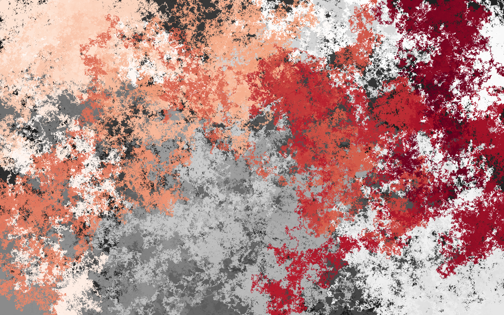
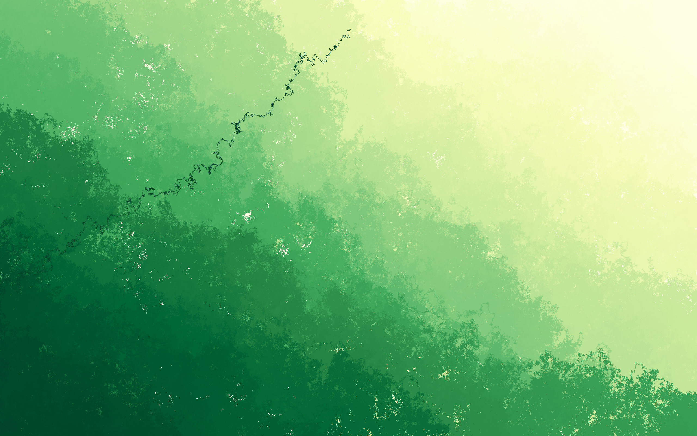
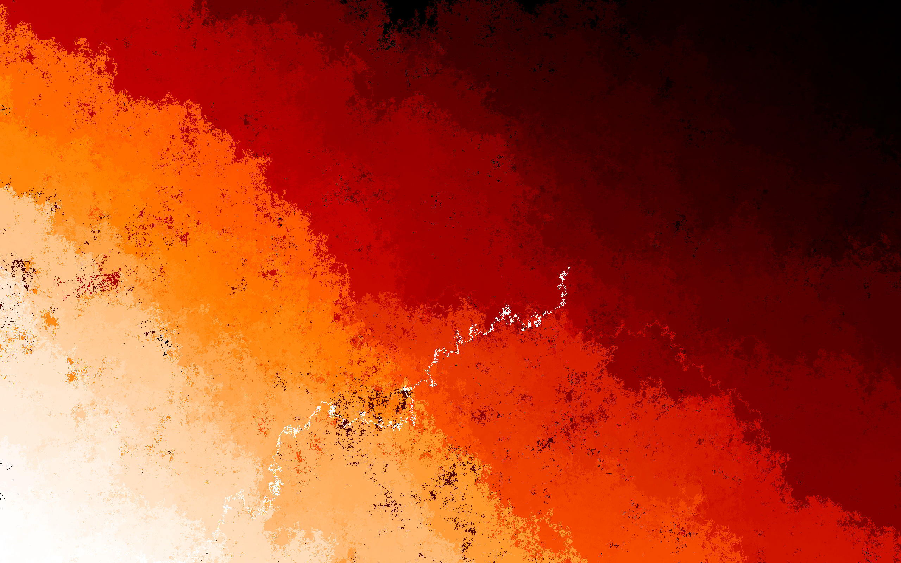

# randwallpaper

[](https://github.com/MichaelWiciak/randwallpaper/actions/workflows/ci.yml)
[](https://pkg.go.dev/github.com/MichaelWiciak/randwallpaper)
[](https://go.dev/dl/)
[](LICENSE)

<div align="center">
  
  
  
</div>

Go random wallpaper generator inspired by Python's [`randimage`](https://github.com/nareto/randimage).

Generates unique, procedural wallpapers using a three-step process:

1. Create a random mask (grayscale image)
2. Trace a path through its pixels
3. Map path position to colour via a procedurally generated colourmap

## Why Go over Python?

The Python `randimage` is great but has limitations this project addresses:

- Performance - Python's EPWT path-finding loops over every pixel sequentially with set operations. Go is 10-50x faster on the same algorithm with zero effort.
- Parallel generation - Go's goroutines make generating batches of wallpapers trivially parallel.
- Single binary CLI - `go install` gives you a static binary with no Python runtime, pip, or virtualenv needed.
- No dependency hell - stdlib handles image encoding, PNG saving, and math. Only one external dependency (`disintegration/imaging`) for Gaussian blur.

## How the algorithm works

### 1. Mask generation

A mask is a grayscale image of the same dimensions as the final wallpaper. It determines the "terrain" the path will follow. Three strategies:

| Mask         | Description                                                                                                                                         |
| ------------ | --------------------------------------------------------------------------------------------------------------------------------------------------- |
| SaltPepper   | Random binary noise - each pixel is 0 or 1. Produces high-contrast, jagged patterns.                                                                |
| Normal       | Gaussian noise - each pixel drawn from N(0,1). Smooth random noise.                                                                                 |
| GaussianBlob | Random centers placed in the image, blurred with a Gaussian filter. Produces organic, blob-like gradients. Most commonly produces pleasing results. |

### 2. Path finding

Given a mask, create a path that visits every pixel exactly once. Two strategies, both starting from a random point and expanding outward in concentric square neighborhoods:

| Path                               | Strategy                                                                                                                                                                |
| ---------------------------------- | ----------------------------------------------------------------------------------------------------------------------------------------------------------------------- |
| EPWT (Easy Path Wavelet Transform) | Greedy - at each step, pick the unvisited neighbor whose mask value is closest to the current pixel. Tends to follow level curves, producing smooth colour transitions. |
| Probabilistic                      | Stochastic - pick a random unvisited neighbor weighted by mask values. Produces noisier, more chaotic patterns.                                                         |

### 3. colourmap

Each pixel in the path gets coloured according to its position: `k / path_length` maps to a colour via a procedural colourmap. colourmaps are generated dynamically by:

1. Picking 3-7 random anchor positions in [0, 1]
2. Assigning each anchor a random RGB colour
3. Interpolating between anchors using smooth (cubic Hermite) interpolation

Every call to `Generate` produces a unique colourmap. No hardcoded colour tables.

## Installation

```bash
# Install the CLI tool
go install github.com/MichaelWiciak/randwallpaper/cmd/randwallpaper@latest

# Or add as a dependency in your Go project
go get github.com/MichaelWiciak/randwallpaper
```

## API

```go
import "github.com/MichaelWiciak/randwallpaper"
```

```go
// Generate creates wallpapers and saves them as PNG files.
//
//   output="wallpaper" with count=1   → saves as wallpaper.png
//   output="wallpaper" with count=5   → creates folder wallpaper/
//                                        with wallpaper_1.png ... wallpaper_5.png
//
func Generate(width, height int, output string, opts ...Option) error
```

### Options

```go
// Number of images to generate (default 1)
func WithCount(n int) Option

// Seed for reproducible results (default: time.Now().UnixNano())
func WithSeed(seed int64) Option
```

### Examples

```go
// Single wallpaper, 1920x1080, saved as "wallpaper.png"
err := randwallpaper.Generate(1920, 1080, "wallpaper")

// Batch of 10 wallpapers, 3840x2160, saved to folder "batch/"
err := randwallpaper.Generate(3840, 2160, "batch", randwallpaper.WithCount(10))

// Reproducible wallpaper
err := randwallpaper.Generate(800, 600, "fixed", randwallpaper.WithSeed(42))
```

## CLI

```
randwallpaper -width 1920 -height 1080 -out wallpaper
randwallpaper -w 1920 -h 1080 -out batch -count 10
randwallpaper -w 800 -h 600 -out test -seed 42
```

```
Usage of randwallpaper:
  -count int
        number of images to generate (default 1)
  -height int
        image height (default 1080)
  -out string
        output file name (without extension) (default "wallpaper")
  -seed int
        random seed (0 = random) (default 0)
  -width int
        image width (default 1920)
```

## Project structure

```
randwallpaper/
├── go.mod                  # module definition + dependencies
├── randwallpaper.go        # public API: Generate(), Option, WithCount, WithSeed
├── mask.go                 # mask interface + SaltPepper, Normal, GaussianBlob
├── path.go                 # path interface + EPWT, Probabilistic
├── colourmap.go            # colourmap type + procedural colourmap generation
├── randwallpaper_test.go   # tests
└── cmd/
    └── randwallpaper/
        └── main.go         # CLI binary
```

## Internal design

All implementation types are unexported:

- `mask` interface - `saltPepperMask`, `normalMask`, `gaussianBlobMask`
- `path` interface - `epwtPath`, `probabilisticPath`
- `colourmap` type - `generateColourmap()`

`Generate()` picks randomly among mask and path types, constructs a random colourmap, and wires them together. This keeps the public API minimal (one function, two options) while the internals remain modular and testable.

## Dependencies

- `github.com/disintegration/imaging` - Gaussian blur for `GaussianBlobMask`
- Everything else: Go stdlib (`image`, `image/png`, `image/color`, `math/rand/v2`, `os`, `flag`)

## Development

```bash
go build ./...               # verify compilation
go vet ./...                 # static analysis
go test ./...                # run tests
go build ./cmd/randwallpaper # build CLI binary
go install ./cmd/randwallpaper  # install CLI to $GOPATH/bin
```

## License

Released under the [MIT License](LICENSE). Copyright (c) 2026 Michael Wiciak.

## References

- [randimage](https://github.com/nareto/randimage) - Python library that inspired this project
- [G. Plonka, "The Easy Path Wavelet Transform"](https://arxiv.org/abs/0912.4604) - EPWT algorithm
- [R. Budinich, "Region Based Easy Path Wavelet Transform"](https://arxiv.org/abs/2108.00725) - RBEPWT variant
